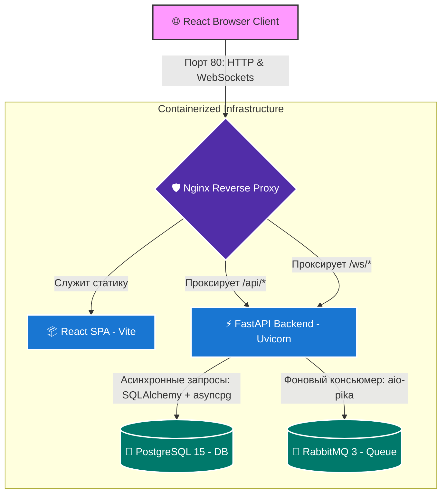

# 🏆 Victory Group Task Manager — Panantukan Team (ЮНИТ hack 2026)

Добро пожаловать в единый репозиторий **Victory Group Task Manager** — высокопроизводительной, событийно-ориентированной Kanban-системы управления задачами с real-time синхронизацией и интеграцией потоков аналитики.

Наше решение построено на базе современных контейнеризованных сервисов, объединенных под управлением высокоэффективного обратного прокси-сервера Nginx.

---

## 🏗️ Архитектура системы

Система реализует масштабируемую событийно-ориентированную архитектуру (Event-Driven Architecture) с единым шлюзом доступа (API Gateway) на базе Nginx.



### Схема прохождения Real-Time событий (Data Flow)

1. **События управления задачами (Task Lifecycle)**:
   - Пользователь перемещает задачу на Kanban-доске $\rightarrow$ Фронтенд отправляет запрос `PATCH /api/tasks/{task_id}` $\rightarrow$ Бэкенд обновляет запись в PostgreSQL.
   - Бэкенд через `ConnectionManager` мгновенно транслирует событие типа `TASK_UPDATED` по WebSocket всем подключенным клиентам.
   - У всех пользователей интерфейс обновляется мгновенно без перезагрузки страниц благодаря реактивному Zustand-хранилищу.

2. **События аналитики и аудита (RabbitMQ $\rightarrow$ WebSockets)**:
   - Внешний сервис аналитики публикует событие (например, критическое падение ROI или рост стоимости лида CPL) в обменник RabbitMQ `victory_events` с ключом маршрутизации `vdl.events`.
   - Внутри FastAPI в фоновом режиме (`asyncio.create_task`) запущен асинхронный консьюмер `consume_events()`.
   - Консьюмер считывает событие, сохраняет его в таблицу базы данных `vdl_events` и рассылает WebSocket-сообщение типа `VDL_ALERT` целевым клиентам.
   - Клиентский React-интерфейс перехватывает событие, выводит всплывающее тост-уведомление (Toast Notification) и подсвечивает карточку задачи тревожным красным индикатором.

---

## 🛠️ Стек технологий

- **Frontend**: React 19, Vite 8, Tailwind CSS v4, Zustand (управление стейтом), `@dnd-kit` (высокопроизводительный Drag & Drop).
- **Backend**: FastAPI (Python 3.11), Uvicorn, SQLAlchemy 2.0 (асинхронный движок), aio-pika (асинхронное взаимодействие с RabbitMQ).
- **Database**: PostgreSQL 15 (Alpine), asyncpg (асинхронный драйвер PostgreSQL).
- **Queue/Broker**: RabbitMQ 3 (Alpine) с плагином Management Console.
- **Gateway & Server**: Nginx (Alpine) в качестве единой точки входа и балансировщика.
- **Orchestration**: Docker, Docker Compose (спецификация 3.8).

---

## ⚡ Быстрый запуск комплекса (Локально)

Все компоненты инфраструктуры полностью оркестрованы. Для запуска всего комплекса в production-ready окружении вам потребуется выполнить **всего одну команду**.

### Системные требования
- Установленный [Docker](https://www.docker.com/products/docker-desktop/)
- Установленный Docker Compose v2.0+

### Пошаговая инструкция

1. **Клонируйте репозиторий и перейдите в корень проекта**:
   ```bash
   cd victory-group-task-manager
   ```

2. **Запустите сборку и развертывание контейнеров**:
   ```bash
   docker-compose up --build -d
   ```
   *Параметр `--build` форсирует сборку Docker-образов фронтенда и бэкенда, а ключ `-d` запускает контейнеры в фоновом режиме.*

3. **Проверьте статус запущенных сервисов**:
   ```bash
   docker-compose ps
   ```

---

## 🔗 Картография портов и URL-адреса

После успешного запуска все сервисы будут доступны по следующим адресам:

| Сервис | URL | Доступы по умолчанию | Описание |
| :--- | :--- | :--- | :--- |
| **Веб-интерфейс (React)** | [http://localhost/](http://localhost/) | *Не требуются* | Kanban-панель управления и дашборд. |
| **Интерактивная API-документация** | [http://localhost/api/docs](http://localhost/api/docs) | *Не требуются* | Swagger UI для проверки эндпоинтов FastAPI. |
| **RabbitMQ Web Console** | [http://localhost:15672/](http://localhost:15672/) | логин: `guest` <br> пароль: `guest` | Панель управления очередями, обменниками и консьюмерами. |
| **База данных PostgreSQL** | `localhost:5432` | БД: `victory_db` <br> пользователь: `postgres` <br> пароль: `postgres` | Персистентное хранилище (данные сохраняются в volume `postgres_data`). |

---

## 🪵 Мониторинг и логирование

Если вам необходимо посмотреть логи конкретного сервиса или всего стека в реальном времени:

- **Все логи стека**:
  ```bash
  docker-compose logs -f
  ```
- **Логи бэкенда (API)**:
  ```bash
  docker-compose logs -f api
  ```
- **Логи фонового консьюмера очередей**:
  В логах сервиса `api` вы увидите детальные сообщения о подключении к RabbitMQ:
  ```text
  Successfully connected to RabbitMQ
  Starting RabbitMQ consumption on queue 'victory_queue'...
  Received RabbitMQ VDL Event: {"type": "ROI", "message": "ROI Критическое снижение -15%", ...}
  ```

---

## 🌟 Особенности DevOps конфигурации

1. **Отказоустойчивость соединений (Robust Reconnection)**:
   При старте через `docker-compose` бэкенд FastAPI может запуститься быстрее, чем брокер сообщений RabbitMQ или база данных PostgreSQL. 
   - База данных снабжена интеллектуальным `healthcheck` (утилита `pg_isready`). Бэкенд не запустится, пока СУБД полностью не перейдет в статус `healthy`.
   - Для RabbitMQ реализован асинхронный цикл повторных попыток подключения (15 попыток с интервалом в 5 секунд), что предотвращает аварийное завершение бэкенда при медленном старте брокера в контейнере.
2. **Многоэтапная сборка (Multi-stage Build)**:
   Docker-образ фронтенда компилируется в Node-окружении, после чего скомпилированные оптимизированные JS/HTML-файлы копируются в чистый Nginx. Вес итогового frontend-контейнера составляет всего **~20 МБ**, что гарантирует молниеносный запуск и развертывание.
3. **Безопасность CORS**:
   Благодаря проксированию через Nginx, браузер клиента отправляет все запросы на один хост (`localhost`). Это полностью решает проблему CORS (Cross-Origin Resource Sharing) без необходимости прописывать лишние заголовки разрешений на бэкенде.
